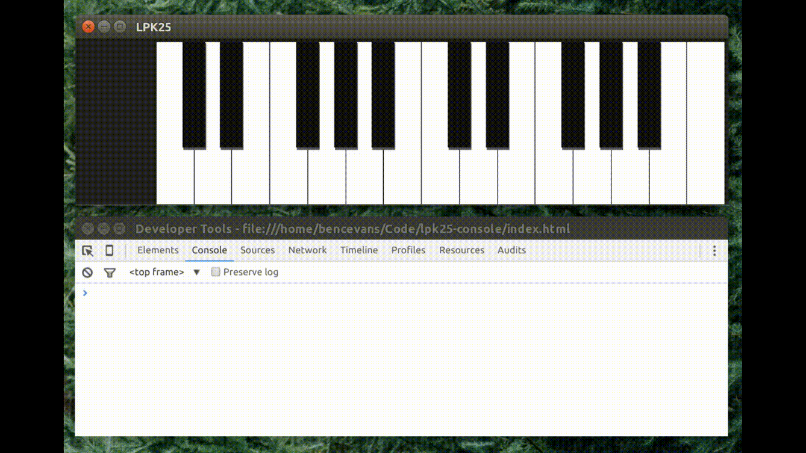

# LPK25 Console

> Virtual Console for the AKAI LPK25 MIDI Keyboard

## Install

    # Download a copy of this repository
    $ git clone https://github.com/bencevans/lpk25-console.git

    # Enter the cloned project
    $ cd lpk25-console

    # Install dependencies
    $ npm install

    # Download daft punk clips included in the iDaft soundboard
    $ npm run download-sounds

    # Start the Electron app
    $ npm start

## Licence

MIT © [Ben Evans](http://bensbit.co.uk)
